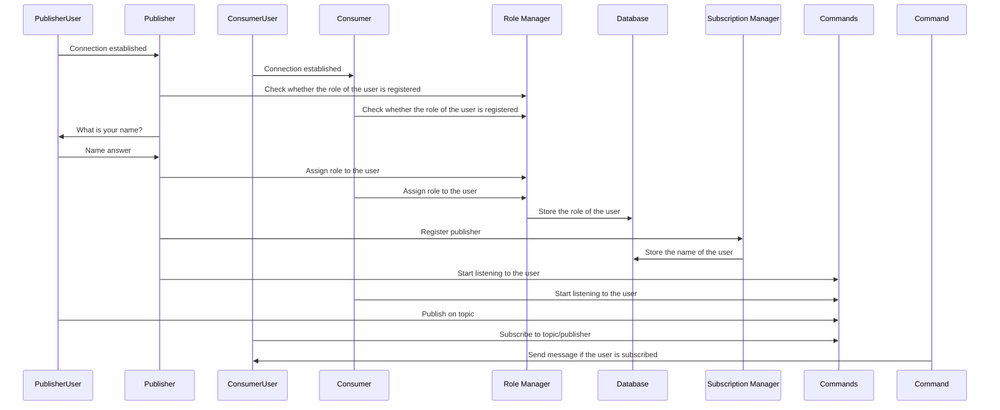

# Laboratory Work Nr.2

## Description

The goal for this project is to create an actor-based message broker application that would
manage the communication between other applications named producers and consumers.

## Message Flow Diagram



## Supervision Tree Diagram


## Installation

### Clone the repository

```bash
 git clone https://github.com/eugencic/real-time-programming/tree/main/lab2
```

### Change the directory

```
 cd lab2
```

### Run the project

Execute this command in the terminal to install all the dependencies of the project

```bash
$ mix run --no-halt
```

Execute these commands to connect via Telnet

```bash
$ telnet 127.0.0.1 4040
```

```bash
$ telnet 127.0.0.1 4041
```
