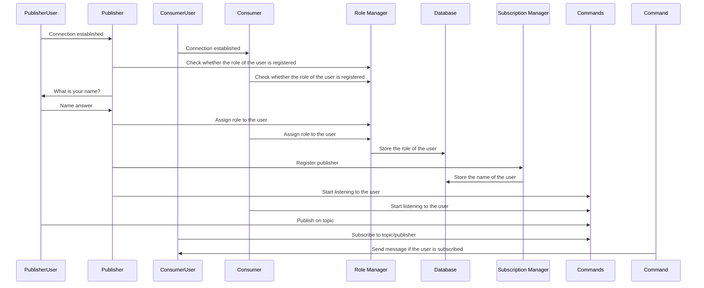

```mermaid
sequenceDiagram
    PublisherUser->>Publisher: Connection established
    ConsumerUser->>Consumer: Connection established
    Publisher->>Role Manager: Check whether the role of the user is registered
    Consumer->>Role Manager: Check whether the role of the user is registered
    Publisher->>PublisherUser: What is your name?
    PublisherUser->>Publisher: Name answer
    Publisher->>Role Manager: Assign role to the user
    Consumer->>Role Manager: Assign role to the user
    Role Manager->>Database: Store the role of the user
    Publisher->>Subscription Manager: Register publisher
    Subscription Manager->>Database: Store the name of the user
    Publisher->>Commands: Start listening to the user
    Consumer->>Commands: Start listening to the user
    PublisherUser->>Commands: Publish on topic
    ConsumerUser->>Commands: Subscribe to topic/publisher
    Command->> ConsumerUser: Send message if the user is subscribed
```

